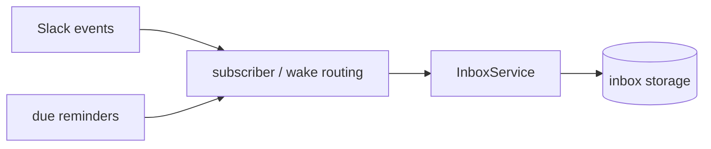
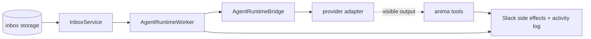

# Server Architecture

`server/` is the local runtime behind Anima. It owns the web API, service process, agent-facing CLI tools, and the durable state boundary around Slack events, reminders, Knowledge Bases, provider runtimes, and web actions.

This document is the server map. It should explain the major components and ownership boundaries, not list every file.

## What Server Owns

- Agent config, home bootstrap, seed memory, Slack connection metadata, and lifecycle mutations.
- Knowledge Base registration, browsing, file reads, downloads, and path safety.
- Inbound work ingestion from Slack and reminders.
- Durable inbox queue semantics: dedupe, claim, follow-up append, stop, recovery, and settlement.
- Runtime execution: prompt construction, provider process protocol, provider session persistence, and activity recording.
- Agent-facing tools exposed through the `anima` CLI, such as Slack messages, files, reactions, reminders, and subscriptions.
- Web HTTP API, static web serving, and daemon supervision.

It does not own provider internals. Codex, Claude, and Kimi adapters speak provider protocols; they do not decide Slack routing, queue policy, visible output, or web UI shape.

## Composition Roots

- `runtime/host.ts` starts the foreground runtime: subscribers, inbox queues, workers, and provider adapters.
- `web/host.ts` starts the local web API and static web server.
- `services/supervisor.ts` owns daemon process control; `cli/animactl.ts` exposes it.
- `cli/anima.ts` is the agent-facing CLI used inside provider runtimes for audited side effects.
- `runtime-management/` owns the npm-installed runtime, release-track checks, and system-update apply worker.

The runtime server reconciles runnable agents in place. A freshly connected agent comes online without restarting other agents, and a running agent reloads itself when runtime-bound config changes. Reloads are per-agent and wait for the current item to finish; full service restarts are still reserved for server code/dependency changes.

## Event Ingestion Flow

Slack events and due reminders are normalized into inbox items first. This keeps wake routing, dedupe, recovery, and audit behavior independent from provider execution.

## Worker Execution Flow

Workers claim durable inbox items and run them through the configured provider. Provider processes do not talk to Slack directly; they call `anima` tools so visible side effects are audited.

Same-session follow-ups are a side path: while an item is running, `followup-appender.ts` can claim a newly queued follow-up and ask the provider to append it to the active run. If the provider rejects the append, the item goes back to the queue and runs later.

The provider's text result is internal. Anima does not automatically post it to Slack. If the spawned agent wants humans to see something, it must call an `anima` tool.

## Runtime Execution Model

One foreground server process may run multiple agents. For each runnable agent, startup wires:

1. A source subscriber for Slack and reminders.
2. A durable inbox queue.
3. A worker loop.
4. A provider adapter selected by agent provider config.

Only one normal inbox item runs per agent at a time. The worker owns item claiming, recovery, and settlement. `active-run-control.ts` owns active-run stop/drain checks and idle timeout aborts.

`AgentRuntimeBridge` is the boundary between Anima semantics and provider protocol. It builds the provider-facing prompt, environment, provider-session input, and activity/effect sinks, then calls the provider contract in `providers/contract.ts`. `provider-runner.ts` owns retry/failure policy around provider process crashes. Provider-facing delivery prompt builders and dynamic payload formatting live together in `runtime/delivery-prompt.ts`. Provider adapters should stay protocol-focused: start/resume the provider, stream events, persist provider session ids through effects, and report provider activity.

See `docs/runtime-providers.md` for provider contract details.

## Agent Services

An agent is not one service. It is a small group of agent-scoped services over one agent id, plus runtime wiring that runs work for that agent. API routes, CLI commands, Slack callbacks, and workers should call these services instead of editing storage files directly.

| Service                 | Scope     | Owns                                                                                                                                                                                               |
| ----------------------- | --------- | -------------------------------------------------------------------------------------------------------------------------------------------------------------------------------------------------- |
| `AgentService`          | one agent | Config CRUD, enable/disable, home/profile/provider mutation, operator-facing session read/rotate, provider-kind session archive side effects, skills visible from the agent home.                  |
| `AgentSlackService`     | one agent | Slack token validation, connect flow, manifest upgrade metadata, bot/workspace display sync, Slack WebClient construction, owner selection, onboarding DM queueing, and private Slack URL fetches. |
| `ActivityService`       | one agent | Activity append/read API, feed pagination, and the inbox join needed by the Activity tab. Domain-specific payload construction stays with the domain that emits the activity.                      |
| `WakeQueueService`      | one agent | Durable wake item lifecycle: enqueue/dedupe, find/list, claim, requeue, stop request, complete/fail, active-run settlement. Product inbox/outbox history lives in `MessageService`.                |
| `RuntimeSessionService` | one agent | Runtime-owned session persistence: primary session upsert, provider session ids, runtime stats, and lifetime token accounting.                                                                     |
| `ReminderService`       | one agent | Reminder records, schedule/cancel/snooze, due scans, repeat math, fire completion, reminder activity rows.                                                                                         |
| `InteractiveAskService` | one agent | Pending ask records, answer validation, click result persistence, answered-message replacement, forbidden-click notices.                                                                           |

Agent runtime execution is intentionally not exposed as a broad `AgentRuntimeService`. Runtime code wires an `AgentRuntimeWorker`, `AgentRuntimeBridge`, and provider adapter for each runnable agent. That layer owns claiming wake work, provider prompt/input construction, active-run follow-up append, idle/stop behavior, and runtime event recording. Runtime session persistence goes through `RuntimeSessionService`.

`RuntimeService` is the web/API view over runtime state. It lists statuses and stops the current item. It should not become the owner of agent config, Slack connection, reminders, sessions, activity history, or provider execution internals.

Managed runtime installation and upgrade orchestration are intentionally separate from agent execution. They live under `runtime-management/`, not `runtime/`, because they operate on the local npm package and services process rather than on a provider turn.

## Registry And Platform Services

Some services are collections or platform-level resources rather than one-agent services.

- `AgentRegistryService` lists and creates agents. Agent creation side effects live here: home creation, default Team KB registration, seed memory, and notes directory bootstrap.
- `KbRegistryService` owns KB collection operations: list, create, browse possible roots, default Team KB registration, and `serviceFor(id)`.
- `KbService` owns one KB root: config read/rename/remove, tree/file/download/raw views, ignore policy, symlink/traversal safety, and response metadata.
- `ServerSettingsService` owns Anima-home level settings such as dashboard host/port and sidebar order. Routes and process launch code should use it instead of reading `config.json` directly.
- `SlackFileService` owns Slack file cache semantics: download-to-cache, cache lookup, cached file reads, cache path construction, and download size limits.
- `SlackWorkspaceDirectoryService` owns Slack workspace lookup/cache for users, channels, DMs, and workspace events. It is scoped by Slack team, not by Anima agent.
- `SlackShortcutService` handles Slack shortcut payloads and dispatches to the owning services: runtime status/stop, reminders, and inbox handoff. It lives under `slack-interactions/` because it is an application workflow, not a low-level Slack API helper.
- `SystemService` owns local system/operator view data and actions for the web API: server info, provider command availability, and web-triggered services restart preparation.

## Boundary Rules

Keep API and CLI thin. They should parse input, call a domain service, redact or shape output, and return. Shared behavior belongs in the owning service or helper, not duplicated in route handlers or command handlers.

- Stores live under `storage/schema/` and own one persisted file family or table. Prefer typed stores over ad hoc filesystem reads/writes.
- Services own workflows and cross-store orchestration. If a method has product semantics or records activity, it usually belongs in a service.
- Runtime provider effects should use runtime-owned sinks (`runtime/activity.ts`, `RuntimeSessionService`) for execution internals such as activity rows, provider session ids, runtime stats, and lifetime token accounting. Do not make provider/runtime code depend back on `AgentService`.
- Shared activity text/payload formatting lives in `activities/format.ts`, not in runtime/provider adapters.
- Pure parsing, formatting, DTO-to-config transforms, validation, path checks, and payload builders should live in nearby helpers, not inside service methods unless the logic is tiny.
- `providers/` own provider CLI protocols only. They do not know Slack wake policy, web response shape, queue semantics, or config mutation semantics.
- `slack/` keeps Slack API/data helpers such as workspace directory lookup, inbound file metadata/download, mentions, manifest helpers, and event surfaces. Slack-triggered application workflows live in `slack-interactions/`; inbox enrichment lives in `inbox/`; Slack-visible side effects and tool-facing display/upload formatting live in `tools/`.

## Process Supervision

Daemon supervision is intentionally separate from API and foreground runtime code.

`services/supervisor.ts` owns process semantics: detached spawn, pid files, stale pid checks, log rotation, stop escalation, and child environment cleanup. CLI service commands and web restart actions should share those semantics instead of implementing process control locally.

Same-environment restarts from inside an active runtime are refused because they would kill the item making the request. Use a fresh shell, the web restart control after the item finishes, or a different environment.

See `docs/service-runbook.md` for service commands and restart procedure.

## Web API And Refresh Model

The web API is local and intentionally plain HTTP. Route handlers should stay small: parse with shared DTO schemas where useful, call domain services, redact secrets, and return view data.

There is no global web SSE stream. Surfaces that need freshness own their own refresh behavior, such as agent statuses or activity polling. Avoid reintroducing a broad cross-web event bus unless the product need is explicit.

## Testing Map

- `tests/web-api.test.ts`: web API contracts, redaction, agent mutations, first-connect onboarding, Slack display sync.
- `tests/kb.test.ts`: Knowledge Base registry, tree/file/download/raw endpoints, ignore and symlink boundaries.
- `tests/inbox.test.ts`: inbox queue enqueue, duplicate handling, and injected stores.
- `tests/runtime-worker.test.ts`: queue claiming, active-run follow-up append, stop, idle timeout, recovery, and reminder wakes.
- `tests/agent-runtime.test.ts`: provider adapters, provider sessions, prompt/env behavior, and runtime events.
- `tests/reminders.test.ts`: schedule, cancel, snooze, repeat math, and reminder delivery.
- `tests/services.test.ts`: daemon supervisor start/stop/restart/status/log behavior.
- `tests/subscriptions.test.ts`: Slack wake rules and subscription windows.

## Related Docs

- `README.md`: product overview and local setup.
- `docs/design.md`: product-level model and terminology.
- `docs/runtime-providers.md`: provider contract and adapter behavior.
- `docs/service-runbook.md`: daemon operations and restart safety.
